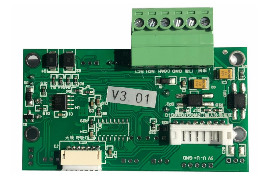

<div align="right">
  <a href="./README.md" target="_blank">
    
  </a>
</div>

# KModuleSDK User Documentation



## 1. Overview

KModuleSDK is the core external class of the hardware SDK. Developers only need to call the APIs of this class to complete all hardware operations. This SDK mainly provides the following functions:

| Function Category | Description |
|-------------------|-------------|
| Card Reading | Supports reading card information |
| Relay Control | Supports relay on/off operations |
| LED Control | Supports LED color, blinking mode and brightness adjustment |

## 2. Quick Start

Add [card_k_module-1.2.6.4.aar](app/libs/card_k_module-1.2.6.4.aar) to your project
```gradle
 implementation files('libs\\card_k_module-1.2.6.4.aar')
```

### 2.1 Initialize SDK

```java
KModuleManagerListener kModuleManagerListener = new KModuleManagerListener() {
  @Override
  public void onSerialDataRead(String sPort, byte[] buffer, int size) {
    Log.i(TAG, "onSerialDataRead: " + new String(buffer, 0, size));
  }
};
HardwareConfig config = new HardwareConfig.Builder("/dev/ttyS3", 9600)
        .readTimeoutMs(5000)
        .isDebug(true)
        .kModuleManagerListener(kModuleManagerListener)
        .build();
try {
    KModuleSDK.init(config);
} catch (SerialPortOpenFailedException e) {
    Log.e(TAG, "init failed: " + e.getMessage());
}
```

### 2.2 Usage Examples

```java
// Turn on the relay
KModuleSDK.getInstance().relayOn();

// Red LED on
KModuleSDK.getInstance().ledRedOn();

// Custom color LED on (FF0000 represents red)
KModuleSDK.getInstance().ledCustomColorAndOn("FF0000");

// Adjust LED brightness (1-99)
KModuleSDK.getInstance().ledBrightness(50);
```

### 2.3 Destroy SDK

```java
// Destroy SDK and release resources
KModuleSDK.getInstance().destroy();
```

## 3. API Detailed Description

### 3.1 Initialization and Configuration

#### `KModuleSDK.init(HardwareConfig config)`
- **Function**: Initialize the SDK
- **Parameters**:
  - `config`: Hardware configuration object, containing serial port path, baud rate, etc.
- **Exceptions**:
  - `SerialPortOpenFailedException`: Thrown when serial port fails to open

#### `KModuleSDK.getInstance()`
- **Function**: Get the SDK singleton instance
- **Return Value**: `KModuleSDK` instance
- **Exceptions**:
  - `SDKNotInitializedException`: Thrown when SDK is not initialized

#### `isDebug()`
- **Function**: Check if it is debug mode
- **Return Value**: `boolean` - true for debug mode, false for non-debug mode

### 3.2 Relay Control

#### `relayOn()`
- **Function**: Turn on the relay

#### `relayOff()`
- **Function**: Turn off the relay

#### `beepOn()`
- **Function**: Turn on the buzzer

#### `beepOff()`
- **Function**: Turn off the buzzer

#### `setOpenTime(int openTime)`
- **Function**: Set relay open time
- **Parameters**:
  - `openTime`: Relay open time (milliseconds)

#### `remoteOpen()`
- **Function**: Remote door open control

### 3.3 Card Reading Functionality

#### `sendSuperAdminCard()`
- **Function**: Send super administrator card

#### `virtualWeighing()`
- **Function**: Virtual weighing

#### `cardNumberOutputToggleEec()`
- **Function**: Card number output toggle (decimal)

#### `cardNumberOutputToggleHex()`
- **Function**: Card number hexadecimal output toggle

#### `cardNumberOutputToggleDecReverse()`
- **Function**: Card number reverse output toggle (decimal)

### 3.4 LED Control

#### Basic Color Control

##### `ledRedOn()`
- **Function**: Red LED on

##### `ledGreenOn()`
- **Function**: Green LED on

##### `ledBlueOn()`
- **Function**: Blue LED on

##### `ledOff()`
- **Function**: Turn off all LED lights

#### Blinking Mode

##### `ledRedBlink()`
- **Function**: Red LED blinking

##### `ledGreenBlink()`
- **Function**: Green LED blinking

##### `ledBlueBlink()`
- **Function**: Blue LED blinking

##### `ledMarquee()`
- **Function**: LED marquee effect

#### Custom Color

##### `ledCustomColorAndOn(String color)`
- **Function**: Custom color LED on
- **Parameters**:
  - `color`: Hexadecimal color string (e.g., "FF0000" represents red)

##### `ledCustomColorBlink(String color)`
- **Function**: Custom color LED blinking
- **Parameters**:
  - `color`: Hexadecimal color string (e.g., "00FF00" represents green)

#### Brightness Control

##### `ledFullBrightness()`
- **Function**: LED full brightness display

##### `ledBrightness(int brightness)`
- **Function**: Adjust LED brightness
- **Parameters**:
  - `brightness`: Brightness value (0-100)

### 3.4 Resource Management

#### `destroy()`
- **Function**: Destroy SDK and release resources (close serial port, set singleton to null)

## 4. Exception Handling

| Exception Class | Description |
|----------------|-------------|
| `SDKNotInitializedException` | Thrown when calling getInstance() before SDK initialization |
| `SerialPortOpenFailedException` | Thrown when serial port fails to open |